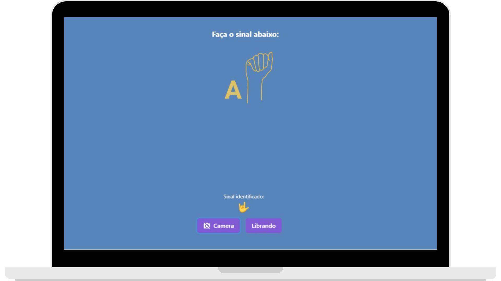
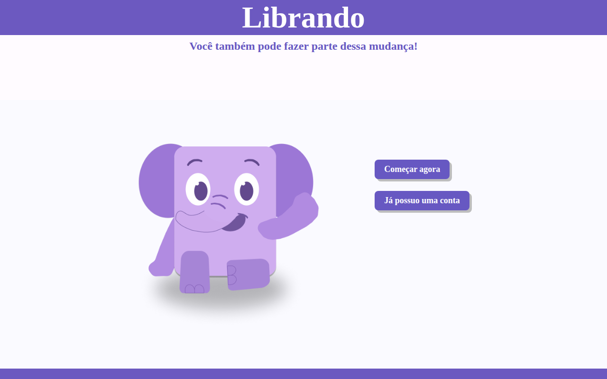
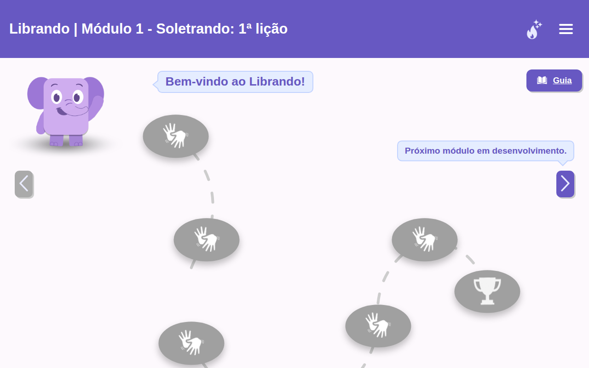
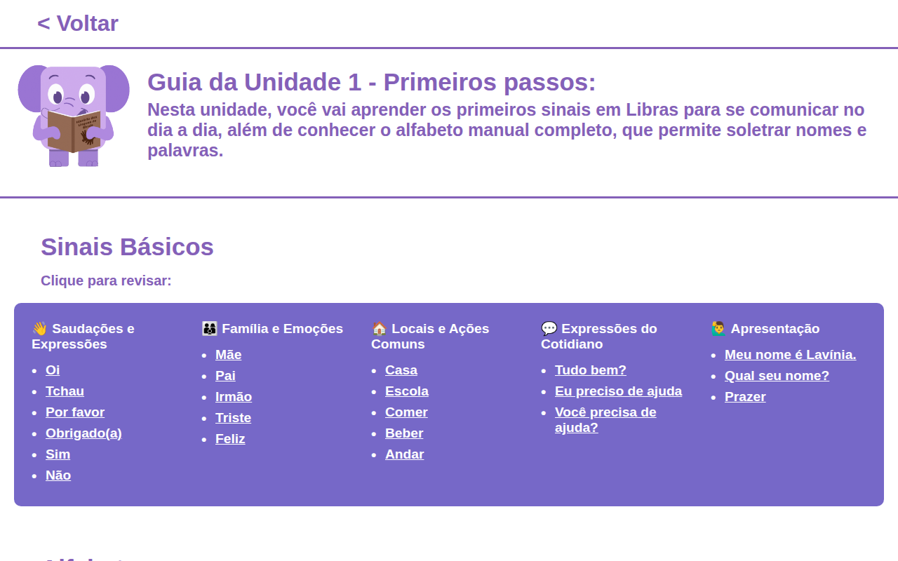
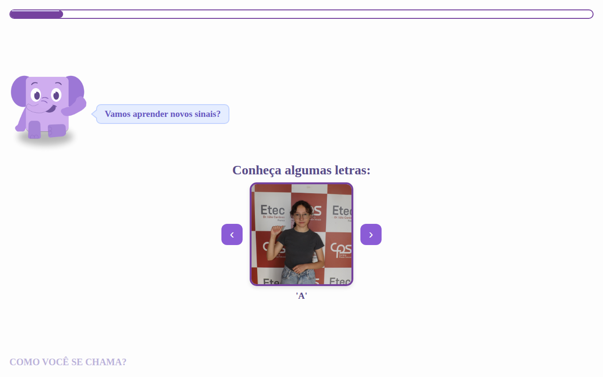
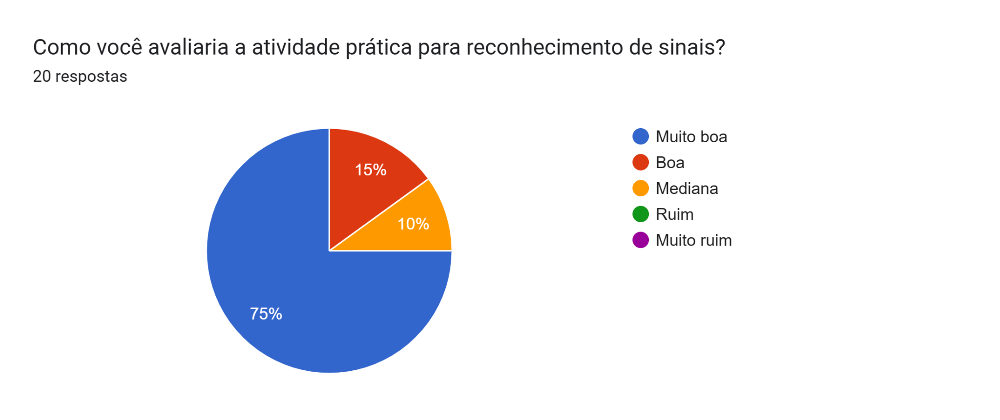

# Librando

Aplicativo web para aprender **Libras** (Língua Brasileira de Sinais) de forma gamificada. O aluno segue uma trilha de lições guiada pela mascote **Lili**, assiste a vídeos dos sinais, resolve exercícios e quizzes, e acompanha o próprio progresso e a ofensiva (dias seguidos de estudo).

> 🏆 **Premiado como Melhor TCC da Etec Dr. Júlio Cardoso em 2025.**

Acesse: **[librandotcc.com.br](https://www.librandotcc.com.br/)** · Instagram: [@librando.tcc](https://www.instagram.com/librando.tcc)

O Librando foi criado para aproximar ouvintes e a comunidade surda e para levar a Libras a mais pessoas. O projeto está alinhado aos Objetivos de Desenvolvimento Sustentável 4 (Educação de Qualidade) e 10 (Redução das Desigualdades) da ONU.

## Destaque: correção de sinais pela câmera

A atividade mais inovadora do Librando corrige o sinal que o próprio aluno faz com as mãos. A tela mostra uma letra do alfabeto manual, o aluno faz o sinal na frente da câmera, e o sistema usa **reconhecimento de imagem por vetorização** para conferir se o gesto está certo:

1. A câmera captura a mão do aluno em tempo real.
2. A imagem da mão é transformada em um vetor, uma lista de números que descreve a posição e o formato da mão.
3. Esse vetor é comparado com o vetor do sinal esperado.
4. Se os dois forem parecidos o bastante, a atividade marca o sinal como correto e dá o retorno na hora.

<p align="center">
  
</p>

Assim o aluno não só reconhece os sinais, mas também pratica a produção deles, com correção automática. Essa atividade roda em um app próprio ([librando-tcc.vercel.app](https://librando-tcc.vercel.app/)), aberto a partir das lições 2 e 6. O código dela não está neste repositório.

## Telas

| Página inicial | Trilha de lições |
| --- | --- |
|  |  |
| **Guia da unidade** | **Lição** |
|  |  |

## Funcionalidades

- Cadastro e login de usuários
- Trilha de lições com marcação das lições concluídas, salva no banco
- Ofensiva diária (atual e melhor)
- Vídeos e imagens dos sinais: alfabeto manual e frases do dia a dia (oi, tchau, meu nome, obrigado, por favor, me ajuda, família, sentimentos e outras)
- Correção de sinais pela câmera, com reconhecimento de imagem por vetorização
- Exercícios de ordenar sinais, escolher o sinal certo e escrever a letra mostrada, além de quizzes
- Guia de estudo da unidade
- Tradução de textos do site para Libras com o plugin [VLibras](https://vlibras.gov.br/)

## Tecnologias

| Parte | Tecnologias |
| --- | --- |
| Frontend | HTML, CSS e JavaScript puro (sem framework), VLibras |
| Backend | Node.js, Express 5, Mongoose, CORS, dotenv |
| Banco de dados | MongoDB Atlas |
| Hospedagem | Frontend na Vercel, API no Railway |

## Estrutura do repositório

```
.
├── frontend/                 # Site estático
│   ├── index.html            # Página inicial (entrar / cadastrar)
│   ├── login.html            # Login
│   ├── cadastro.html         # Cadastro
│   ├── caminho.html          # Trilha de lições e ofensiva
│   ├── guia.html             # Guia da unidade
│   ├── atividades.html       # Lição 1 (segue para ordem, escolha e acertou)
│   ├── licao2.html ...       # Lições 2 a 6 e suas etapas (licaoN-2, licaoN-3...)
│   ├── ordem*.html           # Exercícios de ordenar
│   ├── escolha.html          # Exercício de escolher a resposta
│   ├── quiz*.html            # Quizzes
│   ├── acertou.html          # Tela de acerto, atualiza a ofensiva
│   ├── css/                  # Estilos
│   ├── js/
│   │   ├── config.js         # URL da API usada pelo site
│   │   ├── caminho.js        # Carrega e salva o progresso da trilha
│   │   ├── acertou.js        # Atualiza a ofensiva
│   │   └── JsAtividadeR.js
│   ├── img/                  # Imagens da Lili, letras do alfabeto e ícones
│   └── gestos/               # Vídeos e fotos dos sinais
├── docs/
│   ├── LibrandoTCC.pdf       # Documentação completa do TCC
│   └── screenshots/          # Imagens usadas neste README
└── backend/                  # API REST
    ├── app.js                # Ponto de entrada (porta 3000)
    ├── db/index.js           # Conexão com o MongoDB
    ├── models/userModel.js   # Modelo de usuário (quests e ofensiva)
    ├── controllers/index.js  # Regras de cada rota
    ├── routes/index.js       # Definição das rotas
    └── .env.example          # Variáveis de ambiente necessárias
```

## Como rodar

### Backend

Requisitos: Node.js 18 ou superior e acesso a um cluster do MongoDB Atlas.

```bash
cd backend
npm install
cp .env.example .env   # preencha DB_USER e DB_PASS
npm start              # inicia com nodemon em http://localhost:3000
```

O endereço do cluster fica em `backend/db/index.js`. Se usar outro cluster, troque a `mongoURI` lá.

### Frontend

O frontend é estático, então basta servir a pasta `frontend/`:

```bash
cd frontend
npx serve .            # ou: python3 -m http.server 8080
```

Depois abra o endereço mostrado no terminal. Por padrão o site usa a API de produção. Para usar a API local, troque a URL em `frontend/js/config.js`:

```js
const CONFIG = {
  URL: "http://localhost:3000"
};
```

## Rotas da API

| Método | Rota | Descrição |
| --- | --- | --- |
| GET | `/` | Mensagem de boas-vindas |
| POST | `/register` | Cadastra usuário (`name`, `email`, `password`) |
| POST | `/login` | Faz login (`email`, `password`) e devolve o `id` do usuário |
| GET | `/user/:id` | Dados do usuário (sem a senha) |
| GET | `/user/:id/quests` | Lições concluídas e ofensiva |
| POST | `/user/:id/quest` | Marca uma lição (`key`, `value`) e atualiza a ofensiva |
| POST | `/update-streak/:id` | Atualiza a ofensiva |

Depois do login, o site guarda o `id` do usuário no `localStorage` e usa esse valor nas chamadas seguintes.

## Testes com usuários

Entre 7 e 14 de outubro de 2025, a equipe abriu a plataforma para testes e coletou avaliações por formulário. Alguns resultados:

- **100%** ficaram muito satisfeitos com a mascote Lili
- **90%** avaliaram como muito satisfatória a atividade de escolher o sinal certo
- **85,7%** avaliaram como muito satisfatório o guia da unidade
- **76,2%** avaliaram como muito satisfatórias a página inicial e a trilha de lições
- **75%** avaliaram como muito satisfatória a correção de sinais pela câmera

<p align="center">
  
</p>

### Próximos passos sugeridos pelos usuários

- Deixar o site totalmente responsivo no celular
- Mostrar a resposta certa no teste final quando o aluno erra
- Trocar os `alert` de acerto por mensagens dentro da página
- Melhorar o desempenho da atividade com câmera em computadores mais simples
- Corrigir o botão "Voltar", que leva para o login em vez da página anterior

## Equipe

A documentação completa do projeto está em [docs/LibrandoTCC.pdf](docs/LibrandoTCC.pdf).

Trabalho de Conclusão de Curso do Técnico em Desenvolvimento de Sistemas integrado ao Ensino Médio da **Etec Dr. Júlio Cardoso** (Centro Paula Souza).

- Carolina Bernardes Inocencio
- Cauã Otoni Pereira
- Cauê Borges Carvalho
- Guilherme Ismael Barbosa Bachur
- João Pedro Racero Santos
